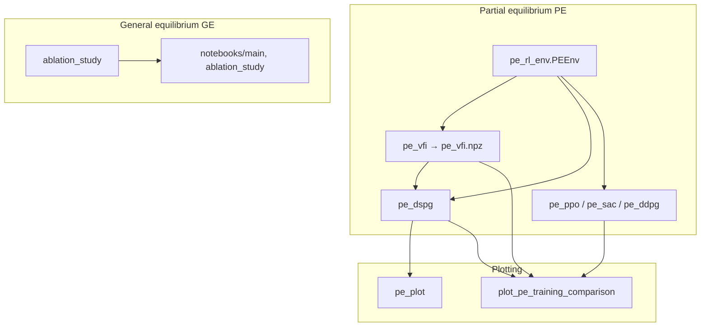

# Architecture & workflows

## Top-level layout

```
Huggett/                    # repo root — run scripts with cwd here
├── dspg/                   # Python package: all runnable entry points
├── dspg/notebooks/         # Jupyter: interactive GE Huggett & ablation plots
├── figures_tables/         # paper figures (PDF) + LaTeX snippets (tracked in git)
├── results/                # training outputs (gitignored by default, local only)
├── requirements.txt
└── README.md
```

The path anchor **`REPO_ROOT`** is defined in [`dspg/repo_paths.py`](../dspg/repo_paths.py): after `import dspg`, `results/` and `figures_tables/` resolve to those folders **under the repository root**, regardless of where the interpreter was started.

## Two experiment lines: PE vs GE

| Layer | Economic meaning | Prices / clearing | Main code entry points |
|-------|------------------|-------------------|-------------------------|
| **Partial equilibrium (PE)** | Exogenous interest rate and wage (Markov on grids) | No GE pricing | [`pe_rl_env.py`](../dspg/pe_rl_env.py), [`pe_vfi.py`](../dspg/pe_vfi.py), [`pe_dspg.py`](../dspg/pe_dspg.py), [`pe_ppo.py`](../dspg/pe_ppo.py), etc. |
| **General equilibrium (GE)** | Huggett bond economy: aggregate bond supply \(B\), market-clearing \(r\) | Bond market clears each period | [`ablation_study.py`](../dspg/ablation_study.py), [`notebooks/main.ipynb`](../dspg/notebooks/main.ipynb) |

They **do not share the same dynamics module**: PE is centralized in `PEEnv`; GE uses grids and transitions embedded in `ablation_study.py` and the notebooks (aligned with the GE illustration in the paper).

## Dependency sketch



## Run conventions (same as root README)

1. **Working directory:** run `python -m dspg.<module>` from the **repository root**.
2. **GPU:** most scripts set `CUDA_VISIBLE_DEVICES` via `--cuda`; [`ablation_study.py`](../dspg/ablation_study.py) parses CLI **before** importing JAX — do not reorder `parse_args()` and `import jax` without revisiting that logic.
3. **Precision:** training scripts typically enable `jax_enable_x64`.
4. **PE pipeline:** run [`pe_vfi`](../dspg/pe_vfi.py) first to produce `results/pe_vfi.npz`, then [`pe_dspg`](../dspg/pe_dspg.py) or RL baselines.

For field-level detail, see [**python-modules.md**](python-modules.md) and [**notebooks-and-artifacts.md**](notebooks-and-artifacts.md).
